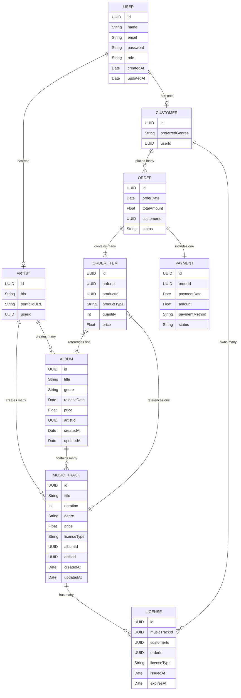

# TemporaryMermaid

```mermaid
erDiagram
    USER {
        UUID id
        String name
        String email
        String password
        String role
        Date createdAt
        Date updatedAt
    }

    ARTIST {
        UUID id
        String bio
        String portfolioURL
        UUID userId
    }

    CUSTOMER {
        UUID id
        String preferredGenres
        UUID userId
    }

    ALBUM {
        UUID id
        String title
        String genre
        Date releaseDate
        Float price
        UUID artistId
        Date createdAt
        Date updatedAt
    }

    MUSIC_TRACK {
        UUID id
        String title
        Int duration
        String genre
        Float price
        String licenseType
        UUID albumId
        UUID artistId
        Date createdAt
        Date updatedAt
    }

    ORDER {
        UUID id
        Date orderDate
        Float totalAmount
        UUID customerId
        String status
    }

    ORDER_ITEM {
        UUID id
        UUID orderId
        UUID productId
        String productType
        Int quantity
        Float price
    }

    PAYMENT {
        UUID id
        UUID orderId
        Date paymentDate
        Float amount
        String paymentMethod
        String status
    }

    LICENSE {
        UUID id
        UUID musicTrackId
        UUID customerId
        UUID orderId
        String licenseType
        Date issuedAt
        Date expiresAt
    }

    %% Relations
    USER ||--o| ARTIST : "has one"
    USER ||--o| CUSTOMER : "has one"
    ARTIST ||--o{ ALBUM : "creates many"
    ARTIST ||--o{ MUSIC_TRACK : "creates many"
    ALBUM ||--o{ MUSIC_TRACK : "contains many"
    CUSTOMER ||--o{ ORDER : "places many"
    ORDER ||--|{ ORDER_ITEM : "contains many"
    ORDER_ITEM }|--|| MUSIC_TRACK : "references one"
    ORDER_ITEM }|--|| ALBUM : "references one"
    ORDER ||--|| PAYMENT : "includes one"
    MUSIC_TRACK ||--o{ LICENSE : "has many"
    CUSTOMER ||--o{ LICENSE : "owns many"

```
